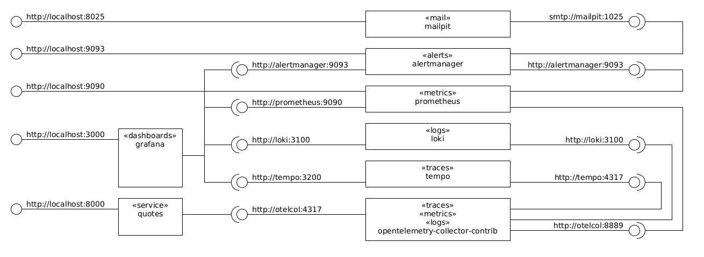

# About

This is a [OpenTelemetry](https://github.com/open-telemetry/opentelemetry-dotnet)/[Grafana](https://github.com/grafana/grafana)/[Prometheus](https://github.com/prometheus/prometheus)/[Tempo](https://github.com/grafana/tempo)/[Loki](https://github.com/grafana/loki) playground.

The following components are used:



# Usage (Ubuntu 22.04)

```bash
# create the environment defined in docker-compose.yml
# and leave it running in the background.
docker compose up -d --build

# show running containers.
docker compose ps

# show logs.
docker compose logs

# open a container network interface in wireshark.
./wireshark.sh quotes

# open the quotes service swagger.
xdg-open http://localhost:8000/swagger

# make a request.
http \
  --verbose \
  http://localhost:8000/quote

# make a failing request.
http \
  --verbose \
  http://localhost:8000/quote?opsi=opsi

# make a request that includes a parent trace.
# NB the dotnet trace id will be set to the traceparent trace id.
# NB the tracestate does not seem to be stored or propagated anywhere.
http \
  --verbose \
  http://localhost:8000/quote \
  traceparent:00-f1f1f1f1f1f1f1f1f1f1f1f1f1f1f1f1-2f2f2f2f2f2f2f2f-01 \
  tracestate:x.client.state=example

# open grafana explore tempo (traces).
xdg-open 'http://localhost:3000/explore?left=%7B%22datasource%22:%22Tempo%22,%22context%22:%22explore%22%7D'

# open grafana explore loki (logs).
xdg-open 'http://localhost:3000/explore?left=%7B%22datasource%22:%22Loki%22,%22context%22:%22explore%22%7D'

# open prometheus (metrics).
xdg-open http://localhost:9090

# open alertmanager (alerts).
xdg-open http://localhost:9093

# open mailpit (email).
xdg-open http://localhost:8025

# destroy the environment.
docker compose down --remove-orphans --volumes --timeout=0
```

# Notes

* .NET uses the [Activity class](https://docs.microsoft.com/en-us/dotnet/api/system.diagnostics.activity?view=net-8.0) to encapsulate the [W3C Trace Context](https://www.w3.org/TR/trace-context/).
  * The Activity `Id` property contains to the [W3C `traceparent` header value](https://www.w3.org/TR/trace-context/#traceparent-header).
    * It looks alike `00-98d483b6d0e3a6d012b11e23737faa50-6ac18089ab13c12e-01`.
    * It has four fields: `version`, `trace-id`, `parent-id` (aka `span-id`), and `trace-flags`.

# Reference

* [W3C Trace Context](https://www.w3.org/TR/trace-context/).
* [opentelemetry-dotnet repository](https://github.com/open-telemetry/opentelemetry-dotnet).
* [OpenTelemetry in .NET documentation](https://opentelemetry.io/docs/languages/net/).
* [OpenTelemetry.Exporter.OpenTelemetryProtocol Environment Variables](https://github.com/open-telemetry/opentelemetry-dotnet/tree/main/src/OpenTelemetry.Exporter.OpenTelemetryProtocol#environment-variables).
